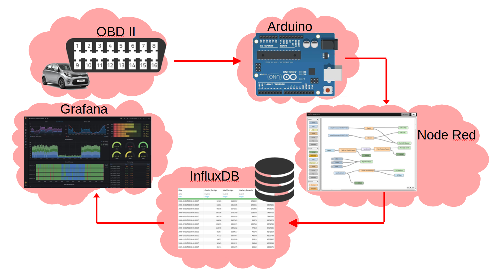

# Fiche "ACS" (Analyse de Cycle de Vie)

## Définition des objectifs et du champ de l'étude

Notre objectif est de récupérer des données d’une voiture compatible (ex: Kia Picanto) disposant d’une prise compatible **OBD II**. Ces données sont récupérées de manière **périodique**, uniquement à titre informatif et sont utiles pour réaliser de l’analyse en **temps réel**. Cette étude vise un public dans le domaine professionnel de l’automobile (ex: Garagiste, Ingénieur automobile, etc…).

## Inventaire du cycle de vie (ICV)
|                |Flux entrant                   			 |Flux sortant                 			|
|----------------|-------------------------------------------|--------------------------------------|
|OBD-II Can		 |Données hexadécimal envoyé par le véhicule | Données hexadécimal 				   	|
|Node red		 |Données hexadécimal 						 | Données hexadécimal traité / filtré 	|
|InfluxDB 		 |Données hexadécimal traité / filtré		 | Données sous forme de time series	|
|Grafana		 |Données sous forme de time series			 | Dashboard							|

## Interprétation des résultats

> Dashboard grafana

## Impact environnemental

Notre projet d’étude vise à **analyser** les données sortantes du véhicule et pourrait permettre **d’optimiser** certains éléments de cette dernière (consommation, ratio air/essence, température d’huile, température du liquide de refroidissement etc etc ) pour notamment réduire la production de CO2 pour les moteurs essence ou encore de particule fine pour les moteurs diesel. Car aujourd’hui la **pollution** due aux voitures est excessivement élevée (Axe 2 du SNTEDD).

Notre projet est **peu coûteux** en terme de composant et permet de réaliser plusieurs analyses une fois un premier batch de données récupéré grâce à notre base de données timestamp. (Axe 4 du SNTEDD).

Ce dernier à néanmoins un inconvénient qui est que notre carte Arduino doit être en permanence alimentée par une source externe ce qui est une **vulnérabilité énergétique** importante (Axe 3 du SNTEDD).

Notre projet est **open source**, il est donc accessible à tout le monde, mais il aurait été intéressant d’avoir avec nous les parties prenantes dans l’orientation de nos recherches. (Axe 6 et 8 du SNTEDD).
