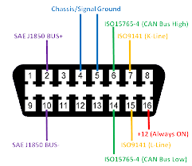
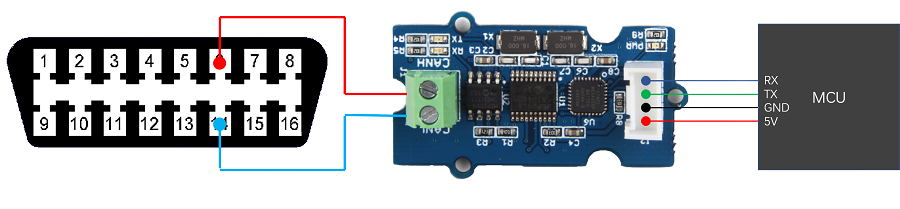
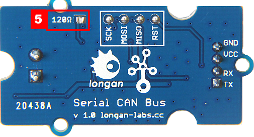
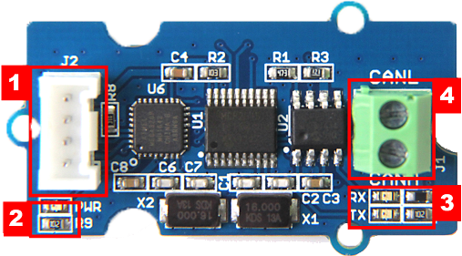
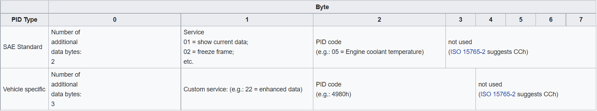
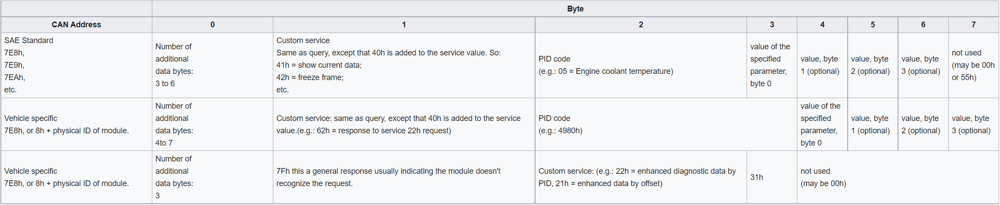
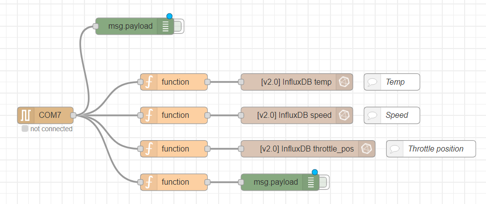
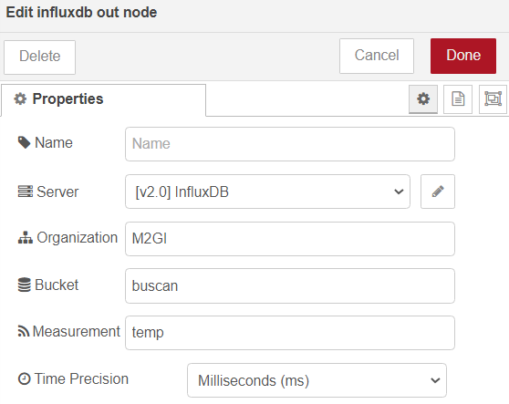

# Rapport technique
## Un peu de contexte
### Qu'est-ce que CAN BUS ?
**CAN** signifie Controller Area Network, il est utilisé pour permettre aux microcontrôleurs et aux appareils de **communiquer entre eux** dans un véhicule sans ordinateur hôte, ce qui permet le contrôle et l'**acquisition de données**. Ces dispositifs sont également appelés unités de contrôle électronique (**ECU**) et ils permettent la communication entre toutes les parties d'un véhicule.

Aujourd'hui, on peut trouver jusqu'à 70 ECU dans une voiture moderne. CAN est un **bus de communication série** conçu pour les applications industrielles et automobiles. Par exemple, on les trouve dans les véhicules, les équipements agricoles, les environnements industriels, etc.

### Comment fonctionne CAN BUS ?
Le niveau de carburant, les capteurs de porte, l'odomètre et bien d'autres parties d'une voiture doivent communiquer entre elles d'une manière ou d'une autre, et CAN BUS est ce qu'ils utilisent pour le faire. Ces composants compatibles CAN, appelés **« nœuds »**, sont connectés avec des fils de cuivre à 3 chaînes, sans routeur central pour régir le flux de données. Chaque **nœud peut entendre les messages de tous les autres nœuds**.

Chaque nœud a un **ID**, où ceux avec l'ID de priorité la plus élevée peuvent avoir la priorité de « parler » en premier pendant que les autres « écoutent ». Cela permet de s'assurer qu'il n'y a jamais deux nœuds qui parlent en même temps. Le plus grand avantage de CAN BUS est de pouvoir simplement connecter des composants sans avoir à se soucier du routage du signal.

## Outils utilisés
Les outils utilisés pour ce projet sont les suivants :
- Carte Serial Can-Bus
- Carte Arduino Uno
- Portection de base Grove V2
- Prise OBD-II
- Voiture Tesla model 3 (Année 2021)

## Outils non gardés
Plusieurs outils on étaient utilisés mais n'ont pas étaient gardés pour des raisons différentes.
- Tout d'abbord la voiture Citroen C3 de 2003 n'a pas pu être gardé pour des raisons d'incompatibilités avec la prise OBD-II.
- La carte STM32 Nucleo 64 avait un problème de compatibilité au niveau du voltage (3.3V au lieu de 5V) pour alimenter la carte Serial Can-Bus.
- Problème de complexité entre le BUS CAN et le Dev Kit LoRa-E5 STM32 (avec carte STM32F0 Discovery pour flasher la carte LoRa-E5)

## Mise en place du système physique
Le protocole CAN BUS se compose de deux fils pour la transmission de données bidirectionnelle que l'on vient brancher sur les **pins 6 et 14** de la prise OBDII (**CAN_H** : Can bus High et **CAN_L** : Can bus low) pour communiquer avec le véhicule.



Puis on vient brancher sur ces fils la carte **Serial Can-Bus** pour, en quelque sorte, agrandir notre réseau CAN. 



Pour la terminaison CAN, un seul **120 Ohm** est généralement utilisé aux 2 extrémités du réseau CAN.



On peut voir que notre carte Serial Can-Bus arrive à lire les données quand nos leds **RX/TX clignotent** _(Encadré rouge n°2 sur l'image ci-dessous)_



On vient par la suite brancher notre Serial Can-Bus sur notre shield **Grove V2** fixé sur notre **Arduino**, pour nous faciliter le branchement des fils. On vient donc brancher un câble grove entre notre Serial Can-Bus (Encadré rouge n°1 sur l'image ci-dessus) et le **port D2** comportant les pins GND, VCC, D3 et D2.


Suite à cela, nous connectons notre arduino sur l'ordinateur pour dans un premier temps **flasher la carte** arduino avec l'IDE Arduino (utilisant du c++). Puis dans un second temps récupérer les données via le **port série** pour les traiter.

## Mise en place du système logiciel
La partie logiciel est décomposé en 4 parties : 
1. Code flashé sur la carte Arduino
2. Interprétation et filtrage des données avec Node Red
3. Stockage des données avec InfluxDB
4. Visualisation intéractive des données avec Grafana (Dashboard)

### Arduino
Nous téléchargeons la librairie [Longan-Labs](https://github.com/Longan-Labs/Serial_CAN_Arduino) qui permet à la carte de comprendre le "langage" du véhicule et de transférer les messages qu'il lit directement à la machine.

Une fois la carte flashée, il suffit de mettre le contact du véhicule et d'afficher la console du **port série** sur lequel on a branché la carte arduino. 
La console va donc afficher les messages que le véhicule envoie.
Les "**trames**" respectent le **standard OBD-II**.

### Qu'est ce que le standard OBD-II ? 
## Requêtes
La **requête PID** fonctionnelle est envoyée au véhicule sur le bus CAN à l'ID 0x7DF, en utilisant *8 octets* de données. Les octets sont :



Le *Code PID* correspond à une information précise. Se reférer à la doc : https://en.wikipedia.org/wiki/OBD-II_PIDs

**Pourquoi 0x7DF ?** Les ECU qui peuvent répondre aux requêtes OBD écoutent à la fois l'ID de diffusion fonctionnel de 0x7DF et un ID attribué dans la plage 0x7E0 à 0x7E7.

## Réponses
Le véhicule répond à la **requête PID** sur le bus CAN avec des ID de message qui dépendent du module qui a répondu. Généralement, le moteur ou l'ECU principal répond à l'ID 0x7E8. D'autres modules, comme le contrôleur hybride ou le contrôleur de batterie d'une Prius, répondent à 0x7E9, 0x7EA, 0x7EB, etc. Ce sont 0x8 de plus que l'adresse physique à laquelle le module répond. Même si le nombre d'octets dans la valeur renvoyée est variable, le message utilise malgré tout 8 octets de données (protocole de bus CAN sous forme de **Frameformat avec 8 octets de données**). Les octets sont :



### Node Red



Avec cette interface, nous récupérons le **flux de données** du port série (COM 7) de la même manière que fait la console arduino. Nous récupérons les données souhaitées via le PID comme vu précédemment. Dans notre cas, nous récuperons la position de la pédale (0x11) et la température du liquide de refroidissement (0x05)\*. Une fois cela effectué, nous **extrayons** les valeurs nécessaire de la trame pour appliquer la **formule** correspondante pour **injecter** le résultat dans la base de données influxDB (de type timestamp).

*\*Nous n'avons pu récupérer que peu de données, parfois erronées (dû à la Tesla), le pourquoi du comment est expliqué dans la section "Problèmes rencontrés".*

### InfluxDB

Pour la configuration d'influxDB il faut commencer par créer un bucket (une table) avec le nom souhaité (pour nous `buscan`).

C'est Node Red qui va s'occuper **d'insérer les données** dans Influxdb via un nœud avec les paramètres souhaités. Dans le nœud, il faut sélectionner l'url du serveur d'InfluxDB, sélectionner la base de données (bucket), définir un nom à la variable (Measurement) et donner la précision du temps (ici en milliseconde) en fonction de la vitesse d'insertion.



### Grafana

Pour connecter InfluxDB à Grafana, il faut donner les identifiants de l'utilisateur et de la base de données ainsi que le bucket cible. Lors du **processus** de création d'un panel grafana, ce dernier affiche les bases de données disponibles. Nous sélectionnons la base de donnée InfluxDB (que nous avons créée et connectée auparavant) pour que l'on puisse récupérer les données avec des **requêtes Flux** pour les convertir en différents graphiques.


Voici un exemple de requête Flux qui recpère toutes les données relatives à la variable `temp` sur la dernière heure passée :
```
from(bucket: "buscan")
	|> range(start: -1h)
	|> filter(fn : (r) => (r._measurement == "temp"))
	|> yield()
```

## Problèmes rencontrés
### Tesla model 3 de 2021
Il est important de savoir que cette tesla comporte 3 prises obd, une à ne pas toucher, une de 20 pins et une dernière de 16 pins. La prise de 20 pins est la prise qui nous intéresse mais n'ayant pas d'adaptateur nous avons dû nous rabattre sur la prise de 16 pins (bloqué et crypté). On ne recevait que des données étranges et assez aléatoires mais nous n'avions que ça. Nous avons donc utilisé ces données comme de vrai données pour avancer dans notre projet.

### Compatibilité
Sevket possédant un mac M1, a eu des soucis de compatibilité avec les différents logiciels, mais disposait d'un véhicule plus ou moins compatible.
Loris n'avait pas de véhicule compatible mais un ordinateur fonctionnel.

Le seul moyen de tester nos codes était donc de se réunir. Sevket étant en alternance nous n'avions pas beaucoup de temps pour tester nos différentes idées.

L’organisation fut donc assez chaotique.
